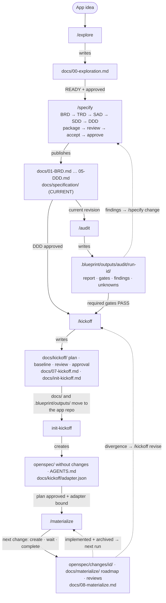

# claude-code-skills

Claude Code plugin marketplace.

## Using this marketplace

Add it in Claude Code:

```
/plugin marketplace add oastashev/claude-code-skills
```

(or, from a local clone: `/plugin marketplace add ./claude-code-skills`)

Then install a plugin from it:

```
/plugin install blueprint@claude-code-skills
```

## Plugins

### blueprint

Five-step pipeline for going from a high-level app idea to an audited
implementation plan and an OpenSpec repository with changes ready to
implement. It stops before implementation: the result is the blueprint, not
the app.



Solid arrows are handoffs through files, labelled with the condition the
consumer checks; dashed arrows return work to an earlier step. No skill starts the
next one automatically.

Each skill keeps its intermediate files in `.blueprint/<skill>/<run-id>/` at the
project root; they are not inputs of later steps. Finished audit reports go to
`.blueprint/outputs/audit/<run-id>/` and are part of the kickoff baseline.

| Skill | Command | Purpose |
|---|---|---|
| explore | `/explore` | Brainstorm and scope the idea → `docs/00-exploration.md` |
| specify | `/specify` | Build BRD/TRD/SAD/SDD/DDD documents one by one, with approval gates |
| audit | `/audit` | Check documentation completeness, traceability and EARS compliance |
| kickoff | `/kickoff` | Write the launch plan `docs/07-kickoff.md` (deployment order, change roadmap starting with a walking skeleton, parallelism analysis — execution waves, critical path and estimated time saving, human checkpoints, audit conditions) and copy an agent-neutral init instruction into `docs/` |
| materialize | `/materialize` | In the app repository after init, one run = one decision: create the next OpenSpec change whose dependencies are archived (proposal, spec deltas preserving requirement meaning, design, tasks), wait for the current changes, or report the plan complete. Refines dependencies from the actual code and specs, checks them against the approved waves and analyses parallelism for 1/2/4 workers → `docs/materialize/roadmap.json`, `docs/08-materialize.md` |

The init instruction is a template from [skills/kickoff/templates/](plugins/blueprint/skills/kickoff/templates/) and travels with `docs/` into the new repository, so any agent can run it:

| File | How to run | Purpose |
|---|---|---|
| `docs/init-kickoff.md` | "execute docs/init-kickoff.md" in the cloned repo | Check the approved plan, initialise OpenSpec and only the agent integrations the project uses, write `AGENTS.md` with the project's actual architecture and commands, record the OpenSpec CLI version, schema and commands in `docs/kickoff/adapter.json`, commit known paths |

Init only prepares the repository: it creates no OpenSpec changes, design/tasks or execution state. `/materialize` then turns the approved plan into OpenSpec changes, one per run. A change counts as done once it is archived; each run creates the next change whose dependencies are all archived, otherwise it reports which changes it is waiting for, or that every change of the plan is archived. Applying changes is a separate, self-contained process: its `max_workers` and execution mode do not gate materialize. Materialize asks no questions: the plan stays authoritative for slices, dependencies, waves and execution mode, dependencies found in the repository that agree with the approved order are recorded as refinements, and defects or contradictions block the run until `/kickoff revise` (or specify and a new audit). Materialize does not implement or archive changes.

See [plugins/blueprint/skills/](plugins/blueprint/skills/) for each skill's full instructions.

## Repository layout

```
.claude-plugin/marketplace.json   # marketplace manifest (this repo)
plugins/
  blueprint/
    .claude-plugin/plugin.json    # plugin manifest
    skills/                       # auto-discovered Claude Code skills
```

## Agent development

Repository instructions, change conventions, and verification commands are in
[AGENTS.md](AGENTS.md). Claude Code loads the same instructions through
[CLAUDE.md](CLAUDE.md).

## Adding a new plugin

1. Create `plugins/<plugin-name>/.claude-plugin/plugin.json`.
2. Add skills/commands/agents under `plugins/<plugin-name>/` (`skills/`, `commands/`, `agents/` are auto-discovered).
3. Register it in `.claude-plugin/marketplace.json`'s `plugins` array with `"source": "<plugin-name>"`.
